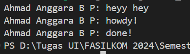

# Experiment 1.2: Understanding How It Works

## Hasil Eksekusi
Berikut adalah bukti jalannya program dengan dua task:

## Penjelasan
Program ini menerapkan konsep **cooperative multitasking**. Ketika Task 1 dieksekusi dan harus menunggu (*pending*) selama 2 detik karena objek `TimerFuture`, Executor tidak diam melainkan langsung beralih mengecek dan menjalankan Task 2.

Karena durasi timer Task 2 hanya 1 detik (lebih cepat selesai dibanding Task 1), background thread Task 2 akan memicu fungsi `wake()` terlebih dahulu. Akibatnya, Task 2 kembali masuk antrean dan diselesaikan oleh Executor sebelum Task 1 terbangun.

# Experiment 1.3: Multiple Spawn and Removing Drop

## Screenshots

### 1. Tanpa `drop(spawner);`

### 2. Dengan `drop(spawner);`

## Analisis

Perbedaan utama saat menghapus dan menggunakan `drop(spawner)` terletak pada kemampuan program untuk melakukan terminasi secara otomatis. Ketika `drop(spawner)` dihapus, program akan mengalami *deadlock* dan terus berjalan di latar belakang meskipun semua teks sudah selesai dicetak. Hal ini terjadi karena fungsi `ready_queue.recv()` pada *executor* bersifat *blocking* dan akan terus menunggu *task* baru selama saluran (*channel*) komunikasi masih dianggap terbuka. Karena *spawner* di fungsi `main` tidak pernah dimatikan, *executor* menduga akan ada *task* baru yang masuk sehingga ia tidak pernah keluar dari *looping*. 

Sebaliknya, saat `drop(spawner)` dipasang kembali, saluran komunikasi ditutup secara eksplisit setelah semua *task* selesai dimasukkan ke antrean. Begitu ketiga *task* selesai dieksekusi dan *cloned sender* di dalamnya ikut hancur, *channel* tersebut mendeteksi bahwa sudah tidak ada lagi *sender* yang tersisa di program. Kondisi ini membuat fungsi `recv()` mengembalikan nilai eror yang memutus *loop* *executor*, sehingga program dapat berhenti dengan aman dan mengembalikan kontrol ke terminal.